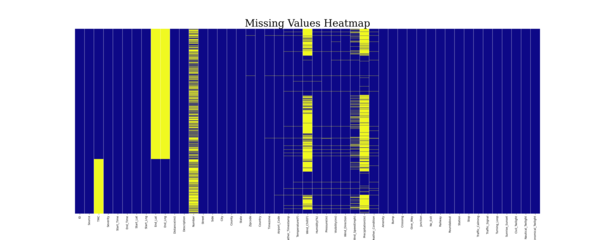
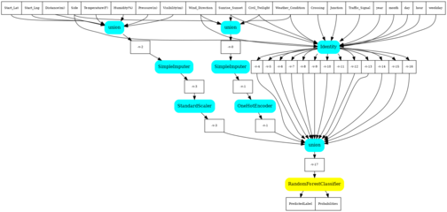
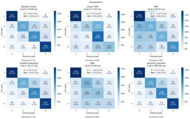
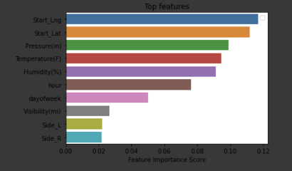

# Machine Learning Capstone Project

---

# Overview

Predicting accident severity

Incentives

- The hight death rate related to road accidents
- The great impact of accidents on society
- Predicting teh severity of accidents helps in decreasing its impact 

---

# Dataset

Car accidents severity in the US (2016-2020) from the source below.

351362 rows and 49 columns

# Data pre-processing

---

# Feature selection

After cleaning and feature selection, the final dataset have 20 features

Selected features are as follows:

    !python
    features=[
    'Start_Lat', 'Start_Lng', 'Distance(mi)', 'Side', 'Temperature(F)', \
    'Humidity(%)', 'Pressure(in)', 'Visibility(mi)', 'Wind_Direction', \
    'Sunrise_Sunset', 'Civil_Twilight', 'Weather_Condition', 'Crossing', \
    'Junction', 'Traffic_Signal', 'year', 'month', 'day', 'hour', 'weekday'\
    ]

# Model

The following models were compared:

- Random Forest
- Gradient Boosting
- Linear SVM
- MLP
- KNN

---

# Random Forest pipeline

---

# Resuls

--- 

# Conclusion

Results show that Grandient Boosting and Random Forest are the best classifiers in this study and that accident location, weather conditions, and time are the features that most impact the severity of an accident.
