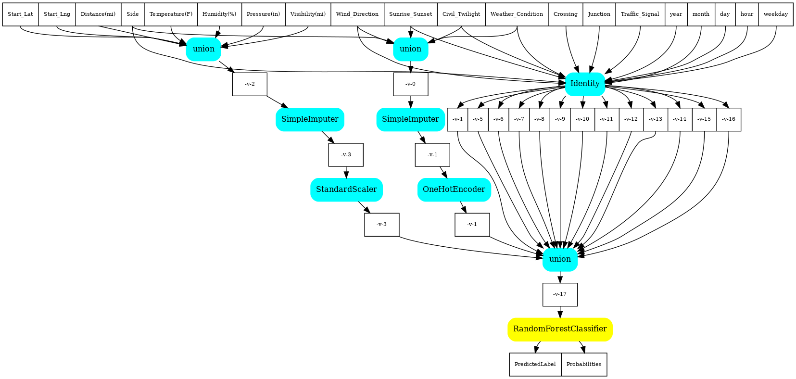
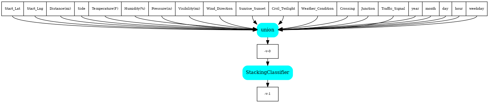
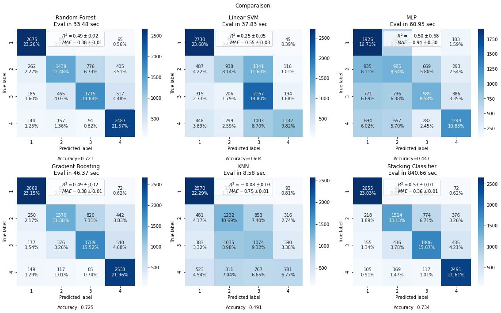
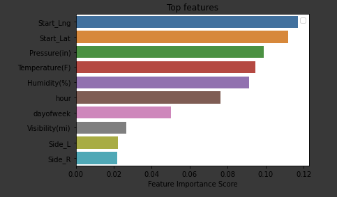

# Introduction
> Buisness problem description

Traffic accident is a wolrdwide major public health concern. In 2017, 115 deaths per million inhabitants were caused by raod accident in the USA. Currently, road crashes are the leading cause of death in the USA. 

One of the most important steps in managing traffic is estimating the severity of an accident. The latter provides critical information for emergency responders to evaluate the gravity level of each situation. Severity analysis helps also in estimating the potential impact of accidents and implementing efficient accident management and avoidance procedures. Furthermore, the accdident severity analysis helps in better managing traffic congestion and minimizing the delay caused by an accident. Finally and most importantly, severity analysis helps reducing the number of traffic accidents and their impact on public health.

This work aims at deriving a machine learning model to predict the severity of a car accident in terms of the impact on traffic delay. This will help authorities to implement efficient procedures to minimise the impact of road accidents. 

# The Data Source
> Description of the dataset

The dataset used in this work is a countrywide car accident dataset that covers 49 states of the USA. The data is collected between February 2016 and June 2020. The collection was done by a variety of entities such as the US and state departments of transportation, law enforcement agencies, traffic cameras, and traffic sensors. The dataset includes about 3.5 million entries.

The dataset consists of 48 features. Each record has an unique identifier. A column indicates the source entity that collected the data record. The start time and end time of the accident are recorded as well as the starting and ending points latitude and latitude.
These information clearly help predicting the traffic delay that could be caused by the accident. For instance, an accident that occurs on a main highway in the rush hour is likely to result in a longer traffic delay than an accident that occurs in the countryside at midnight. Below is the list of columns in the dataset.

For more details about the dataset, the reader is referred to [this page](https://smoosavi.org/datasets/us_accidents).

This work uses the afformentioned dataset to predict the severity of the impact of an accident in terms of traffic delay.

# Methodology
## Data preperation
### Original data shape
Before any data processing, the data has a shape equal to `(3513617, 49)`.
### The target
The target, i.e. label, column is named `Severity`. All the dataset entries have Severity values. The latter has 4 different values: 1, 2, 3, and 4, where 1 is the least impact on traffic and 4 is the most impact on traffic. 

While almost 67% of the dataset entries have Severity of 2, less than 1% of entries have Severity of 1.

The dataset is clearly skewed, and this will need some imbalance processing. I chosed to down-sample all the target classes to the minority class, i.e. Severity of 1.

### Collecting entity
Almost 69% of the entries are collected from MapQuest, ~29% are collected from Bing, and less 2% of entries have source as MapQuest-Bing.

### Datetime
> How to use the `Start_Time` column

The `Start_Time` column is very interesting because, at leat theoritically, the time when the accident occured may determine the severity impact of that accidient. In order to efficiently exploit this column, I decided to decompose it into multiple columns as follows.

- year
- month
- day
- day
- weekday

A further step that could be done is to correlate the date with holidays and important events like elections, festivals, riots, etc. But this has not been done within this project due to time constraints.

### Categorical features

## Feature selection
> What features are selected for the learning phase and how they were selected

### Uninteresting columns
The following features were not concidered because they don't bring information about the Severity or because they are redundant with other columns.

```python
['ID', 'Source', 'Timezone', 'Airport_Code', 'Zipcode', \
'Weather_Timestamp', 'Country', 'State', 'Description', \
'City', 'Astonomical_Twilight', 'Notical_Twilight']
```

### Missing values
An important process that guides the feature selection is the resolving the missing values. Below is the heatmap of all the missing values in the entire dataset where a yellow color denotes a missing value.


Firstly, I started to look into the columns having more than 20% of missing values, this gave the following.

```
na in TMC: 29.4%
na in End_Lat: 70.5%
na in End_Lng: 70.5%
na in Number: 64.4%
na in Wind_Chill(F): 53.2%
na in Precipitation(in): 57.6%
```
My decision was to completely drop these columns since they won't give any benefit with this level of missing values.

Then, I looked into the rest of the columns still having missing values that looked as follows.

```
na in Temperature(F): 1.9%
na in Humidity(%): 2%
na in Pressure(in): 1.6%
na in Visibility(mi): 2.1
na in Wind_Speed(mph): 12.9%
na in Wind_Direction: 1.7%
na in Weather_Condition: 2.2%
na in Sunrise_Sunset: 3.3e-3%
na in Civil_Twilight: 3.3e-3%
```


For the above columns, I decided to fill the missing values as follows:
- with the column mean for `['Temperature(F)', 'Humidity(%)', 'Pressure(in)', \
'Visibility(mi)', 'Wind_Speed(mph)']` since they are of numerical type.
- with the previous value for `['Weather_Condition', 'Wind_Direction', \
'Astonomical_Twilight', 'Notical_Twilight', 'Civil_Twighlight', 'Sunrise_Sunset']` that are of categorical type. Since theoretically, the same location will have approximately the same weather and twilight conditions, this filling step has been done after sorting values with by the location of the accident using the following columns `['Start_Time', 'County', 'City']`.

At this point, there are no missing values left in the dataset and the data shape is `(3513617, 33)`.

### Final List

Following is the final list of features that where selected for the machine learning phase.

```python
features=[
'Start_Lat', 'Start_Lng', 'Distance(mi)', 'Side', 'Temperature(F)', \
'Humidity(%)', 'Pressure(in)', 'Visibility(mi)', 'Wind_Direction', \
'Sunrise_Sunset', 'Civil_Twilight', 'Weather_Condition', 'Crossing', \
'Junction', 'Traffic_Signal', 'year', 'month', 'day', 'hour', 'weekday'\
]
```

At this point the shape of the dataset is `(3513617, 21)` including the target column. Note that the number of rows may vary because of the random nature of the sample procedure.

## Pre-processing

A `onehotencoder` is applied on the columns of categorical type.

A `standardscaler` is applied on the columns of numerical type.

Furthermore, since training a model with ~3 Million inputs is time and ressource conusming, I chosed to randomly select 10% of the dataset using `sample(frac=0.1) procedure of pandas.DataFrame`. Then, as already explained, a down-sampling is applied to cope with the skewness of the target classes.

## Modeling

Since the target is more of a categorical type, a classification algorithm will be the choice for the machine learning phase.

In order to get the best results, the choice was to compare the classification performance of multiple models. To facilitate the process, I chosed to implement all the steps into pipelines. Accordingly, five pipelines where defined for five different classification algorithms. The list of these algorithms is as follows:

- Random Forest
- Linear SVM
- MLP
- Gradient Boosting
- KNN

Following is a visualization of the pipeline of Random Forest. Other pipelines are very similar.

<center><b>Random Forest pipeline</b></center>




Finally, a pipeline was added for stacking all the algorithms using a StackingClassifier model. The purpose of this pipeline is to stack the output of individual models and use a classifier to compute the final prediction. This allows the stength of each model by using their output as input for final classifier. The final classifier is set to LogisticRegression. 

Following is a visulization of the pipeline of for the Stacking Classifier where the feeding models are not shown.

<center><b>Stacking Classifier pipeline</b></center>



Cross validation is used to train and test each of the pipeline. The confusion matrix in the results section is obtained using the `cross_val_predict` procedure of `sklearn`.

# Results
## Confusion matrix
The results are shown in the form of confusion matrix for each of the algorithms described in the previous section. It is clear that the Random Forest and Gradient Boosting algorithms outperform teh rest of algorithms with much hogher accuracy, `0.725` for Gradient Boosting. Furthermore, the Stacking Classifier performance is superior than individual algorithms with an accuracy of `0.734`.



## Features importances
This section show the results of Random Forest algorithm in the form of the importance of each feature on the classification task.




# Conclusion
The goal of this study was to analyse the different features that determine the severity of raod accidents. Firstly, the search for datasets led to an important database of more than 3 Million entries. The first step was to understand the data and prepare for the study. Unimportant columns were droped and missing values were treated using different approaches depeding on the number of missing value per columns. Then, the features were selected after a careful study of the correlation matrix. Next, datetime column was processed to fetch year, month, day, weekday in different columns. Finally, multiple pipelines were created to design the best classification method for the study.

The results of this study showed that the most important factor that drives the severity of an accident is the location of that accident, i.e. Start_Lng and Start_Lat fearures. In the second place comes the weather condiditions and finally the time period within the day.

